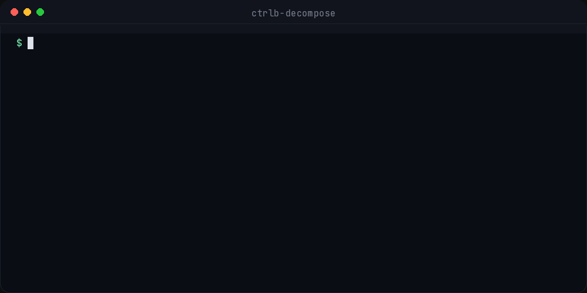
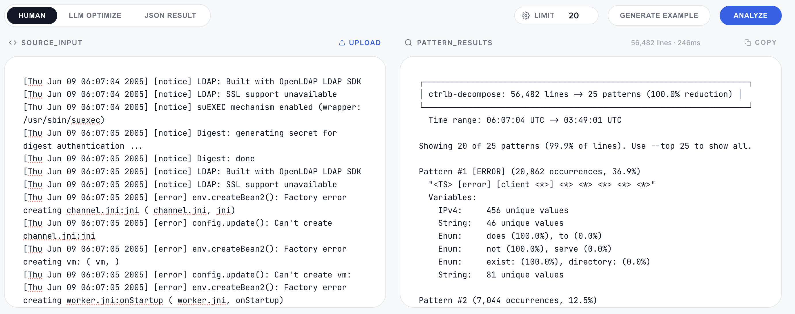
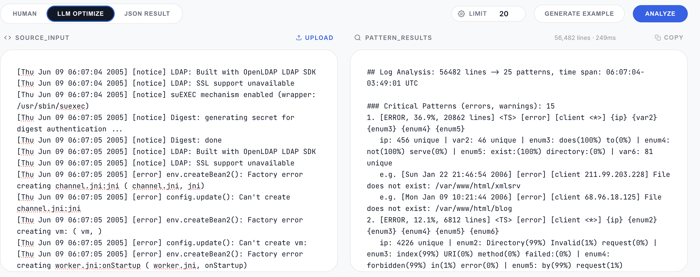

# ctrlb-decompose

**Turn millions of noisy log lines into compact patterns with typed variables, quantiles, anomalies, and LLM-ready output.**

Runs as a CLI, in the browser via WASM, or as a Rust library — no logs ever leave your machine.



> Website: [ctrlb.ai](https://ctrlb.ai/)

---

## Try it in 60 seconds

No install, no signup — the whole pipeline (CLP encoding, Drain3 clustering, typing, stats) runs client-side in WebAssembly.

1. Open **[ctrlb.ai/decompose](https://ctrlb.ai/decompose)**
2. Paste or drop in a log file (or click **Generate Example** to try it with sample data)
3. Hit **Analyze** and watch thousands of lines collapse into a handful of typed patterns

---

## Before / after

A real 56,482-line Apache-style error log, decomposed live in the [browser demo](https://ctrlb.ai/decompose):

**Before** — raw, repetitive, un-skimmable:

```
[Thu Jun 09 06:07:05 2005] [error] env.createBean2(): Factory error creating channel.jni:jni ( channel.jni, jni)
[Thu Jun 09 06:07:05 2005] [error] config.update(): Can't create channel.jni:jni
[Thu Jun 09 06:07:05 2005] [error] env.createBean2(): Factory error creating vm: ( vm, )
[Thu Jun 09 06:07:05 2005] [error] config.update(): Can't create vm:
[Thu Jun 09 06:07:05 2005] [error] env.createBean2(): Factory error creating worker.jni:onStartup ( worker.jni, onStartup)
... 56,477 more lines like this ...
```

**After** — 25 typed patterns, ranked by volume, in 246ms:

```
ctrlb-decompose: 56,482 lines → 25 patterns (100.0% reduction)
Time range: 06:07:04 UTC → 03:49:01 UTC

Pattern #1 [ERROR] (20,862 occurrences, 36.9%)
  "<TS> [error] [client <*>] <*> <*> <*> <*> <*>"
  Variables:
    IPv4:   456 unique values
    String: 46 unique values
    Enum:   does (100.0%), to (0.0%)
    Enum:   not (100.0%), serve (0.0%)
    Enum:   exist (100.0%), directory (0.0%)
    String: 81 unique values

Pattern #2 (7,044 occurrences, 12.5%)
  ...
```

### Output modes

**`HUMAN` mode** — colored, for terminal investigation:



**`LLM OPTIMIZE` mode** — compact markdown for feeding into an LLM:



---

## Resources

| Resource | |
|---|---|
| **Live browser demo** | [ctrlb.ai/decompose](https://ctrlb.ai/decompose) |
| **Claude Code plugin** | [github.com/ctrlb-hq/ctrlb-decompose/tree/main/plugin](https://github.com/ctrlb-hq/ctrlb-decompose/tree/main/plugin) |
| **Research paper** | [ctrlb.ai/research](https://ctrlb.ai/research) |

---

## How It Works

ctrlb-decompose uses a **two-stage normalization and clustering pipeline** that processes logs in a single streaming pass with minimal memory footprint.

```
                         ┌──────────────────────────────────────────────┐
                         │            ctrlb-decompose pipeline          │
                         └──────────────────────────────────────────────┘

  Raw Log Lines
       │
       ▼
┌──────────────┐    Strip & parse timestamps (ISO 8601, Apache,
│  Timestamp   │    syslog, Unix epoch, etc.) into normalized
│  Extraction  │    <TS> markers with DateTime values.
└──────┬───────┘
       │
       ▼
┌──────────────┐    Replace integers, floats, IPs, and strings
│     CLP      │    with compact placeholder bytes. Structurally
│   Encoding   │    identical lines now produce the same "logtype."
└──────┬───────┘
       │
       ▼
┌──────────────┐    Tree-based similarity clustering (Drain3) groups
│   Drain3     │    logtypes into patterns. Differing tokens become
│  Clustering  │    <*> wildcards. Incremental — no second pass needed.
└──────┬───────┘
       │
       ▼
┌──────────────┐    Merge CLP-decoded values with Drain3 wildcard
│   Variable   │    positions. Classify each variable into semantic
│  Extraction  │    types: IPv4, UUID, Duration, Enum, Integer, etc.
│  & Typing    │
└──────┬───────┘
       │
       ▼
┌──────────────┐    DDSketch quantiles (p50/p99), HyperLogLog
│  Statistics  │    cardinality estimation, top-k values, temporal
│ Accumulation │    bucketing, and reservoir-sampled example lines.
└──────┬───────┘
       │
       ▼
┌──────────────┐    Frequency spikes, error cascades, low-cardinality
│   Anomaly    │    flags, bimodal distributions, and clustered
│  Detection   │    numeric detection.
└──────┬───────┘
       │
       ▼
┌──────────────┐    Keyword-based severity (ERROR > WARN > INFO > DEBUG),
│   Scoring    │    temporal co-occurrence, shared variable correlation,
│ & Correlation│    and error cascade detection across patterns.
└──────┬───────┘
       │
       ▼
┌──────────────┐
│    Output    │──── Human (ANSI terminal) / LLM (compact markdown) / JSON
└──────────────┘
```

### Stage 1 — CLP Encoding

[CLP (Compressed Log Processor)](https://www.usenix.org/system/files/osdi21-rodrigues.pdf) encoding normalizes variable tokens into typed placeholders, so structurally identical lines produce identical logtypes regardless of the actual values:

```
Input:   "Request from 10.0.1.15 completed in 45ms status=200"
Logtype: "Request from <dict> completed in <float>ms status=<int>"
```

### Stage 2 — Drain3 Clustering

The Drain algorithm builds a prefix tree over logtypes and groups them by token similarity (configurable threshold, default 0.4). Where tokens diverge, the template gains a `<*>` wildcard. This runs incrementally — each line is processed once with no second pass.

### Variable Classification

Extracted variables are classified into semantic types for richer analysis:

| Type | Example | Detection |
|------|---------|-----------|
| `IPv4` / `IPv6` | `10.0.1.15` | CIDR pattern match |
| `UUID` | `550e8400-e29b-...` | 8-4-4-4-12 hex format |
| `Duration` | `45ms`, `3.2s` | Numeric + time unit suffix |
| `HexID` | `0x1a2b3c` | 4+ hex digits |
| `Integer` | `200` | Parses as i64 |
| `Float` | `3.14` | Contains `.`, parses as f64 |
| `Enum` | `ERROR` | Low cardinality (<=20 unique, top-3 >= 80%) |
| `Timestamp` | `2024-01-15T14:22:01Z` | RFC 3339 pattern |
| `String` | anything else | Fallback |

### Memory Efficiency

- **Drain3 clusters**: O(k) with LRU eviction (default 10k max)
- **Quantiles**: DDSketch — fixed ~200 bytes per numeric slot, no raw value storage
- **Cardinality**: HyperLogLog++ — ~200 bytes per high-cardinality variable
- **Examples**: Reservoir sampling — bounded buffer per pattern

---

## Installation

### macOS (Homebrew)

```bash
brew tap ctrlb-hq/tap
brew install ctrlb-decompose
```

### Debian / Ubuntu

```bash
curl -LO https://github.com/ctrlb-hq/ctrlb-decompose/releases/download/v0.1.0/ctrlb-decompose_0.1.0-1_amd64.deb
sudo dpkg -i ctrlb-decompose_0.1.0-1_amd64.deb
```

### Windows x64

Download `ctrlb-decompose-x86_64-pc-windows-msvc.zip` and its `.sha256` file from
[GitHub Releases](https://github.com/ctrlb-hq/ctrlb-decompose/releases).
The ZIP contains `ctrlb-decompose.exe`; no Rust installation is required.

In PowerShell, compare the ZIP's SHA-256 hash with the value in the `.sha256` file:

```powershell
Get-FileHash .\ctrlb-decompose-x86_64-pc-windows-msvc.zip -Algorithm SHA256
Get-Content .\ctrlb-decompose-x86_64-pc-windows-msvc.zip.sha256
```

Extract the ZIP and run the executable from PowerShell:

```powershell
Expand-Archive .\ctrlb-decompose-x86_64-pc-windows-msvc.zip -DestinationPath .\ctrlb-decompose
.\ctrlb-decompose\ctrlb-decompose.exe --version
.\ctrlb-decompose\ctrlb-decompose.exe --json "C:\logs\server.log"
Get-Content "C:\logs\server.log" | .\ctrlb-decompose\ctrlb-decompose.exe --json
```

Optionally, add the extracted directory to your user `PATH` to run
`ctrlb-decompose` from any directory. This is a command-line tool; run it in a
terminal instead of double-clicking the executable.

### Build from source

```bash
git clone https://github.com/ctrlb-hq/ctrlb-decompose.git
cd ctrlb-decompose
cargo build --release
# Binary at target/release/ctrlb-decompose
```

---

## Usage

```bash
# Pipe from stdin
cat /var/log/syslog | ctrlb-decompose

# Read from file
ctrlb-decompose server.log

# LLM-optimized output (compact, token-efficient)
ctrlb-decompose --llm app.log

# JSON output
ctrlb-decompose --json app.log

# Top 10 patterns with 3 example lines each
ctrlb-decompose --top 10 --context 3 app.log
```

### Options

```
ctrlb-decompose [OPTIONS] [FILE]

Arguments:
  [FILE]          Log file path (reads stdin if omitted or "-")

Options:
      --human         Human-readable output with colors (default)
      --llm           LLM-optimized compact markdown
      --json          Structured JSON output
      --top <N>       Show top N patterns (default: 20)
      --context <N>   Example lines per pattern (default: 0)
      --no-color      Disable ANSI colors
      --no-banner     Suppress header/footer
  -q, --quiet         Suppress progress messages
  -h, --help          Show help
  -V, --version       Show version
```

---

## Output Formats

ctrlb-decompose has three output modes, all driven off the same analysis pass — pick the one that fits where you're reading it. See the [before/after screenshots](#before--after) above for `--human` and `--llm` side by side in the browser demo.

| Format | Flag | Best for |
|--------|------|----------|
| **Human** | `--human` (default) | Terminal investigation — colored, visual bars |
| **LLM** | `--llm` | Feeding into LLMs — compact, token-efficient markdown |
| **JSON** | `--json` | Programmatic consumption — structured, machine-readable |

<details>
<summary><b>Human</b> — <code>ctrlb-decompose server.log --top 2</code></summary>

```
┌──────────────────────────────────────────────────────────────────┐
│ ctrlb-decompose: 80,000 lines -> 3 patterns (100.0% reduction) │
└──────────────────────────────────────────────────────────────────┘
  Time range: 14:22:01 UTC -> 16:35:10 UTC

Pattern #1 (75,211 occurrences, 94.0%)
  "<TS> INFO [<*>] Request from <*> completed in <*> status=<*>"
  Variables:
    HexID:    804 unique values
    IPv4:     27 unique values
    Duration: mean=46, p50=45, p99=116, min=3, max=169
    Integer:  mean=224, p50=198, p99=498, min=200, max=503

Pattern #2 [WARN] (2,773 occurrences, 3.5%)
  "<TS> WARN [<*>] Connection pool exhausted, waiting <*>"
  Variables:
    HexID:    726 unique values
    Duration: mean=526, p50=529, p99=889, min=150, max=900
```

</details>

<details>
<summary><b>LLM</b> — <code>ctrlb-decompose server.log --llm</code></summary>

Compact, token-efficient markdown designed to be pasted straight into a prompt — see the [LLM OPTIMIZE screenshot](#before--after) above for a full real-world example against a 56K-line log.

</details>

<details>
<summary><b>JSON</b> — <code>ctrlb-decompose server.log --json --top 1</code></summary>

```json
{
  "summary": {
    "total_lines": 80000,
    "pattern_count": 3,
    "patterns_shown": 1,
    "patterns_omitted": 2,
    "time_range": {
      "start": "2026-08-21T14:22:01.051+00:00",
      "end": "2026-08-21T16:35:10.707+00:00"
    }
  },
  "patterns": [
    {
      "id": 1,
      "template": "<TS> INFO [<*>] Request from <*> completed in <*> status=<*>",
      "count": 75211,
      "frequency_pct": 94.0,
      "severity": "info",
      "variables": [
        { "slot": 0, "type": "HexID", "unique_count": 804 },
        { "slot": 1, "type": "IPv4", "unique_count": 27 },
        { "slot": 2, "type": "Duration", "unique_count": 157 },
        { "slot": 3, "type": "Integer", "unique_count": 4 }
      ]
    }
  ]
}
```

</details>

---

## Claude Code Plugin

Use ctrlb-decompose directly from [Claude Code](https://claude.ai/code) — no CLI knowledge needed. The plugin installs ctrlb-decompose automatically and lets you analyze logs just by asking.

### Install

```
/plugin marketplace add ctrlb-hq/ctrlb-decompose
/plugin install ctrlb-decompose@ctrlb-hq
```

### Usage

Just describe what you want in plain language:

- "Analyze the errors in `/var/log/app.log`"
- "What are the most common patterns in this log file?"
- "Summarize these logs and highlight anomalies"

Claude will check if ctrlb-decompose is installed (and walk you through installation if not), run the analysis, and explain the results — surfacing errors first, calling out anomalies, and suggesting what to investigate next.

See [github.com/ctrlb-hq/ctrlb-decompose/tree/main/plugin](https://github.com/ctrlb-hq/ctrlb-decompose/tree/main/plugin) for full details.

---

## License

[MIT](LICENSE)
